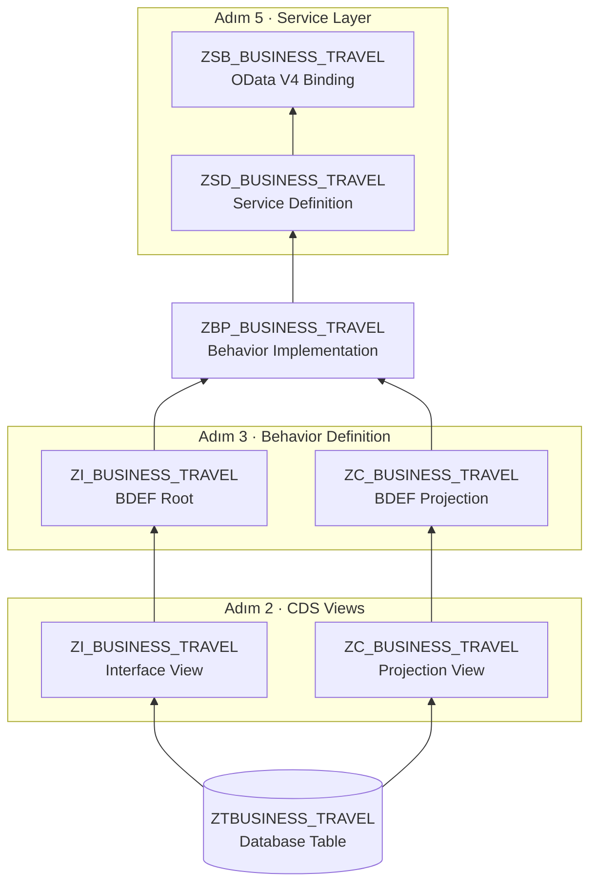

```mermaid
flowchart BT
    DB[("ZTBUSINESS_TRAVEL\nDatabase Table")]

    subgraph CDS ["Adım 2 · CDS Views"]
        ROOT["ZI_BUSINESS_TRAVEL\nInterface View"]
        PROJ["ZC_BUSINESS_TRAVEL\nProjection View"]
    end

    subgraph BDEF ["Adım 3 · Behavior Definition"]
        BROOT["ZI_BUSINESS_TRAVEL\nBDEF Root"]
        BPROJ["ZC_BUSINESS_TRAVEL\nBDEF Projection"]
    end

    IMPL["ZBP_BUSINESS_TRAVEL\nBehavior Implementation"]

    subgraph SRV ["Adım 5 · Service Layer"]
        SDEF["ZSD_BUSINESS_TRAVEL\nService Definition"]
        SBND["ZSB_BUSINESS_TRAVEL\nOData V4 Binding"]
    end

    DB --> ROOT & PROJ
    ROOT --> BROOT
    PROJ --> BPROJ
    BROOT & BPROJ --> IMPL
    IMPL --> SDEF --> SBND
```